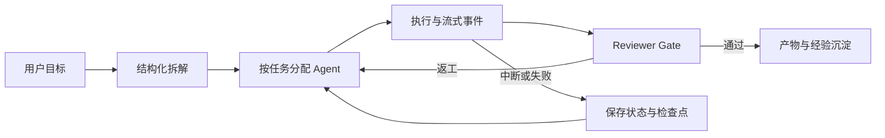

# myteamOUO

> 一个本地优先、可观察、可恢复的多 Agent 协作控制台。

[](https://github.com/jhryo25/myteamOUO/actions/workflows/ci.yml)
[](https://nodejs.org/)
[](LICENSE)

myteamOUO 把 Codex、Claude Code、Kimi 等本机 Agent CLI 串成一条可管理的任务流水线。用户负责目标和关键决策，系统负责拆解任务、分配 Agent、注入上下文、跟踪执行、跨 Agent 审查、返工和恢复。

它不是新的模型，也不是通用桌面 Agent 运行时。它更像本机 Agent 之上的协作控制面：保留现有 CLI 的能力，同时让执行过程有状态、有证据、可暂停、可审计。

## 为什么做这个项目

同时使用多个 Agent 时，真正昂贵的往往不是提问，而是人工管理：

- 在多个终端之间复制目标、文件路径和历史结论；
- 决定任务应该交给哪个 Agent；
- 判断任务是否真的完成，而不是只给出了一段回答；
- 处理审批、失败、返工和服务重启后的恢复；
- 找回散落在聊天、日志和工作区里的交付物。

myteamOUO 把这些动作变成统一的会话、任务、工作流、审批和产物对象。

## 核心流程



一条典型任务会经历：

1. 将目标拆成 3–7 个带负责人、步骤和验收标准的任务；
2. 根据每条任务选择的 Agent 逐项执行；
3. 注入 Continuity Capsule、相关历史证据和 Git 工作区快照；
4. 把 reasoning、tool call、tool result、final 和 error 统一成时间线事件；
5. 由 Reviewer 对照验收标准审查，失败时保留 Agent 结果并支持只重试 Reviewer；
6. 将任务、检查点、审批、产物和经验保存到本地 SQLite。

## 主要能力

### 多 Agent 编排

- 支持 Codex、Claude Code、Kimi 及基于它们创建的 Agent 变体；
- 支持对话模式、拆任务模式和 `@mention` 路由；
- 每条任务可以单独修改执行 Agent，也可以执行全部待处理任务；
- LangGraph 管理执行、审查、返工、人工 Gate 和 checkpoint 恢复。

### 连续上下文

- Continuity Capsule 保存目标、约束、决策、完成事实和下一步；
- Top-K Evidence 只检索当前任务最相关的历史；
- Workspace Bridge 在执行前读取 Git 状态、最近提交和工作区变更；
- 执行 Agent 与 Reviewer 使用同一份任务上下文。

### 安全与治理

- 敏感操作经过服务端审批、操作指纹和有效期校验；
- 支持单次批准、会话批准、拒绝和超时；
- 审计记录自动脱敏 Token、Secret、API Key 和 Cookie；
- 工作区文件读取与打开经过 realpath 边界检查；
- 自动化任务遇到需要审批的操作时默认暂停。

### 可观察与可恢复

- SSE 实时流与 SQLite 历史回放共享同一套事件语义；
- 右侧任务面板实时展示待执行、执行中、验收、返工和失败状态；
- 支持停止、恢复、失败节点重试和 Reviewer-only 重试；
- 服务重启后可从持久化 checkpoint 和 adapter descriptor 恢复工作流。

### 产物与自动化

- 会话文件面板集中展示 Markdown、JSON、HTML 和工作区文件；
- Skills 支持按需、常驻和手动加载；
- Cron 任务支持时区、互斥、审批暂停和运行历史；
- 仓库附带美股日报工具链，演示“采集 → 清洗 → 指标 → 异常 → 报告 → 校验”。

## 快速开始

### 环境要求

- Node.js `22.5+`；
- 至少一个受支持的本机 Agent CLI；
- Windows、macOS 或 Linux。

### 安装

```bash
git clone https://github.com/jhryo25/myteamOUO.git
cd myteamOUO
npm install
```

复制环境变量示例：

```bash
# macOS / Linux
cp .env.example .env

# Windows PowerShell
Copy-Item .env.example .env
```

在 `.env` 中填写本机 CLI 路径：

```env
KIMI_PATH=C:\path\to\kimi.exe
CLAUDE_PATH=C:\path\to\claude.cmd
CODEX_PATH=C:\path\to\codex.cmd
```

Kimi Code CLI 0.14+ 使用 `--prompt ... --output-format stream-json`；旧配置中的 `--print` 会在加载时自动移除。

### 启动

```bash
node server.mjs --port 7878
```

打开 [http://localhost:7878](http://localhost:7878)。首次进入时，状态栏会检查 Agent 路径与可启动性；也可以在设置页修改工作区和 Agent 配置。

## 使用方式

### 直接对话

在对话模式输入问题，或使用 `@codex`、`@claude`、`@kimi` 指定 Agent。

### 拆任务执行

1. 切换到“拆任务”；
2. 输入目标并选择规划 Agent；
3. 检查任务步骤、验收标准和待确认问题；
4. 按需修改每条任务的执行 Agent；
5. 点击“执行全部”，或只执行某个 Agent 的任务；
6. 在工作流卡片和右侧任务面板查看执行、审查和返工状态。

### 处理失败

- Agent 执行失败：重试该任务；
- Reviewer 失败：保留 Agent 结果，只重试 Reviewer；
- Reviewer 要求返工：任务返回执行阶段，达到上限后明确标记；
- 服务或页面重启：从 checkpoint 和当前运行状态恢复。

## 架构

```text
Browser UI
  ├─ Chat / Plan / Task panel / Hub
  ├─ Skills / Approvals / Schedules / Artifacts
  └─ REST + SSE
          │
server.mjs
  ├─ Agent CLI adapters and stream parsers
  ├─ Approval, audit, artifacts and scheduler
  ├─ Session/task services under server/
  └─ LangGraph workflow ports
          │
workflow/
  ├─ Dispatch graph and task subgraph
  ├─ Turn graph
  └─ SQLite checkpointer
          │
storage.mjs / governance.mjs / scheduler.mjs
```

当前生产入口仍是 `server.mjs`。`server/` 保存已拆出的配置、路由和领域服务，项目采用渐进式模块化，避免一次性重写破坏现有工作流。

## 目录结构

```text
myteamOUO/
├─ server.mjs                 # 当前 HTTP/SSE 主入口
├─ agent-utils.mjs            # CLI 配置、启动、流解析与任务仓储适配
├─ storage.mjs                # SQLite 仓储与迁移
├─ governance.mjs             # 审批、指纹和审计
├─ scheduler.mjs              # Cron 调度与运行历史
├─ collaboration-context.mjs  # Capsule、Evidence、Workspace Bridge
├─ server/                    # 渐进拆分的配置、路由和领域服务
├─ workflow/                  # LangGraph 图、端口、检查点和清理
├─ web/                       # 原生 Web UI、样式和模块化前端脚本
├─ tests/                     # Node 测试与端到端生命周期测试
├─ tools/                     # 数据处理和报告工具链
├─ docs/                      # 分类后的架构、产品与工程文档
├─ skills-registry/           # 本地 Skill registry
├─ reports/                   # 本地报告输出，默认不作为核心源码
├─ HANDOVER.md                # 当前交接状态
└─ ISSUES.md                  # 原始问题与修复记录
```

完整文档索引见 [docs/README.md](docs/README.md)。根目录中的 `index.html` 和 `myteam.py` 是早期原型/兼容入口，主应用不依赖它们启动。

## 本地数据

默认运行数据位于 `.myteam/`：

- `myteam.sqlite`：会话、任务、工作流、审批、调度和经验；
- `agents.json`：Agent 定义与变体；
- `skills.yaml`：Skill 加载策略；
- `runs/`：本地运行日志与临时状态。

`.env`、`.myteam/`、运行日志和本地产物不应提交到公开仓库。

## 开发与验证

```bash
# 语法检查
npm run check

# TypeScript 检查
npm run typecheck

# 完整测试
npm test
```

CI 会在 push 和 pull request 时执行语法检查、TypeScript 检查和不依赖本地数据的核心测试集。

## 产品边界

myteamOUO 借鉴了 [LobsterAI](https://github.com/netease-youdao/LobsterAI) 的本地执行、权限和产物体验，也参考了 [Clowder AI](https://github.com/zts212653/clowder-ai) 的多 Agent 协作与治理思路，但不复制它们的完整技术体量。

当前坚持：

- 单 Node 服务 + 原生 Web UI；
- 复用用户已有的 Agent CLI；
- SQLite 本地持久化；
- 显式 Reviewer 与人工 Gate；
- LangGraph 只负责编排，不取代业务数据和权限边界。

近期优先级是稳定多 Agent 协作闭环、安装体验和真实用户指标，而不是追求更多模型、Skills 数量或完整桌面运行时。

## 文档

- [文档中心](docs/README.md)
- [当前交接](HANDOVER.md)
- [Issue Tracker](ISSUES.md)
- [架构评估](docs/architecture/architecture-evaluation.md)
- [LangGraph 实现说明](docs/architecture/langgraph-p1-p4-implementation.md)
- [竞品对比与迭代路线](docs/architecture/roadmap-vs-lobsterai-clowder.md)
- [代码审查报告](docs/reviews/code-review.md)
- [前端审查报告](docs/reviews/frontend-review.md)

## License

[MIT](LICENSE)
