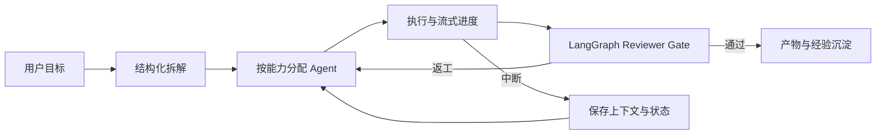

# myteamOUO

> 一个本地优先的多 Agent 协作控制台：把 Codex、Claude Code、Kimi 等本机 CLI 串成可拆解、可执行、可审查、可恢复的任务流水线。

[](https://nodejs.org/)
[](#验证)
[](#验证)
[](https://github.com/jhryo25/myteamOUO/settings/branches)
[](LICENSE)

## 30 秒理解这个项目

同时使用多个 AI Agent 时，真正消耗人的往往不是提问，而是管理：手工复制上下文、判断该找谁、追踪谁做到了哪一步、检查结果，以及在中断后重新解释一遍。

myteamOUO 在模型和用户之间增加了一层轻量协作控制面：

- 用户只描述目标，系统把目标拆成带负责人和验收标准的任务；
- 不同 Agent 按能力协作，执行结果自动进入 Reviewer Gate；
- 会话、任务、审批和产物保存在本地 SQLite，刷新或中断后可以继续；
- Shell、Skill 安装和任务执行经过风险分级、审批和脱敏审计；
- 全程使用本机 Agent CLI，不要求把项目数据交给额外的云端数据库。

它解决的不是“让模型回答得更多”，而是让多 Agent 工作过程更少依赖人工搬运，并且更可控。

## 一条任务如何完成



例如，用户提出“分析一个仓库并修复问题”后，myteamOUO 可以：

1. 生成 3–7 个带验收标准的子任务；
2. 将调研、实现、审查分配给不同 Agent；
3. 在执行前注入当前工作区状态和相关历史证据；
4. 展示 reasoning、工具调用、结果和错误组成的时间线；
5. 对高风险操作暂停并请求批准；
6. 将未通过的任务连同返工意见重新放回待执行队列。

## 用户痛点与产品价值

| 常见痛点 | myteamOUO 的处理 | 用户价值 |
|---|---|---|
| 多个 AI 窗口之间反复复制上下文 | Mention 路由、结构化派生任务、Continuity Capsule | 减少人工充当“消息路由器” |
| 复杂目标容易漏步骤、难验收 | 结构化 Plan、负责人、取舍与验收标准 | 从聊天答案升级为可管理任务 |
| 单模型既执行又自审，容易有盲区 | 跨 Agent Reviewer Gate 和返工闭环 | 提高结果可信度 |
| 刷新、停止或服务重启后进度丢失 | SQLite 状态、运行状态机、继续对话 | 降低长任务中断成本 |
| 本地 Agent 能执行命令，但风险不透明 | 风险分级、操作指纹、单次/会话审批、脱敏审计 | 保留执行力，同时让权限可控 |
| Agent 产物散落在对话和目录中 | 会话文件面板、预览、安全路径校验 | 更快找到和复用交付物 |

## 核心能力

### 1. 场景化首次使用与人工验收

- 首页自动展示可启动 Agent 和当前工作区，未配置时直接进入 Agent 设置。
- 内置仓库诊断、竞品研究、数据报告、需求审查四个场景模板；选择模板只填入目标，不会自动执行。
- 任务面板用“待执行 / 执行中 / 待验收 / 返工 / 已验收 / 阻塞”表达用户可理解的生命周期。
- Reviewer Gate 同时展示自动审查结果和人工评分卡；正确性、完整性、证据与安全全部确认后才能通过，返工必须给出说明。

### 2. 多 Agent 编排

- 接入 Codex、Claude Code、Kimi 等本机 CLI，并支持自定义 Agent 变体。
- 支持 `@mention` 路由，以及结构化 `<spawn_subagent>` 派生协议。
- 将目标拆成 3–7 个可验收任务，按 Agent 执行并进入 Reviewer Gate。
- 不可用 Agent 会回退到可启动实例，避免计划只停留在纸面。

### 3. 连续上下文

- Continuity Capsule 保存目标、约束、决策、已完成事实、失败和下一步。
- Top-K Evidence 只检索最相关的历史证据，避免把全部历史塞进上下文。
- Workspace Bridge 在执行前读取 Git 状态、最新提交和工作区改动。
- 执行 Agent 与 Reviewer 使用同一份任务上下文，减少交接失真。

### 4. 安全与治理

- Shell、Skill 安装/卸载、配置写入和任务执行共用风险策略层。
- 敏感操作生成服务端审批对象；批准后的载荷必须与原始操作指纹一致。
- 支持批准一次、会话批准、拒绝和超时，不提供永久授权。
- 审计记录自动脱敏 Token、Secret、API Key、Cookie 和环境变量。

> 安全边界：myteamOUO 只控制自己管理的 REST/SSE 与执行入口，不声称拦截外部 CLI 内部的每一次工具调用。

### 5. 可观察、可恢复的执行

- 将 Agent 输出统一为 `reasoning / tool_call / tool_result / final / error` 有序事件。
- 实时 SSE 与 SQLite 历史回放使用同一套时间线语义。
- 会话状态覆盖 `running / interrupting / interrupted / completed / error`。
- 用户停止任务后等待旧子进程收口，再允许继续，避免新旧回复交叉写入。
- LangGraph 工作流卡片展示当前节点与 checkpoint；暂停时可直接通过、返工或补充澄清，失败节点可按原任务集合重新派发。

### 6. 扩展与自动化

- Skills 支持按需加载、启停、卸载，以及从 registry、GitHub、ZIP 或本地目录导入。
- Cron 任务支持时区、启停、互斥、运行历史，并默认暂停等待审批。
- Agent 输出中的 Markdown、JSON、HTML 和本地文件引用可进入产物面板。
- 项目附带美股日报工具链，作为“数据抓取 → 统计 → 报告 → 校验”的自动化案例。

## 关键产品取舍

myteamOUO 参考了 [Clowder AI](https://github.com/zts212653/clowder-ai) 的多 Agent 协作、身份与 Skills 思路，也吸收了 [LobsterAI](https://github.com/netease-youdao/LobsterAI) 的本地执行、权限、持久化和子代理追踪设计，但没有直接复制它们的技术体量。

| 选择 | 原因 |
|---|---|
| 单 Node 服务 + 原生 Web UI | 降低安装和调试成本，先验证协作闭环 |
| 本机 CLI Adapter | 复用用户已有的模型账号、工具链和执行能力 |
| SQLite 本地持久化 | 不引入云数据库，同时获得事务、迁移和可恢复状态 |
| 显式人工 Gate | 在自动化成熟前，让关键决策仍由人掌握 |
| 按需 Skills 与 Top-K Evidence | 控制上下文噪声和调用成本 |
| LangGraph 只负责工作流编排 | CLI、业务任务和审批仍由现有边界负责，避免框架侵入业务数据 |
| 暂不引入 Electron/OpenClaw | 保持轻量定位，避免 MVP 过早承担完整桌面运行时复杂度 |

更完整的取舍记录见 [LobsterAI 对比](docs/lobsterai-comparison.md)、[Clowder AI 差距](docs/clowder-html-gap.md) 和 [架构评估](docs/architecture-evaluation.md)。

## 快速启动

要求：Node.js `22.5+`，并至少安装一个受支持的 Agent CLI。

```bash
git clone https://github.com/jhryo25/myteamOUO.git
cd myteamOUO
cp .env.example .env
npm install
npm run rebuild  # 如 better-sqlite3 版本不匹配
node server.mjs --port 7878
```

打开 `http://localhost:7878`，并在 `.env` 中配置本机 CLI 路径：

```env
CODEX_PATH=C:\path\to\codex.exe
CLAUDE_PATH=C:\path\to\claude.exe
KIMI_PATH=C:\path\to\kimi.exe
```

Kimi Code CLI 0.14+ 使用 `--prompt ... --output-format stream-json`；旧配置中的 `--print` 会在加载时自动移除。

## 架构概览

```text
Browser UI
  ├─ Chat / Plan / Task Timeline / Hub
  ├─ Skills / Approvals / Schedules / Artifacts
  └─ SSE live events + history replay
             │
server.mjs ──┼─ server/services/   (lesson, session-store, skill-registry, logger…)
             ├─ server/routes/     (sessions, agents, skills, static-files)
             ├─ server/middleware/  (CORS)
             └─ LangGraph ports
             │
workflow/ ───┼─ Dispatch graph / Task subgraph
             ├─ Chat / Plan / Schedule turn graph
             └─ SQLite checkpointer / interrupt + resume
             │
  ┌──────────┼───────────────┐
storage.mjs  governance.mjs  scheduler.mjs
business DB  policy/audit    Cron/run history
             │
Codex CLI / Claude Code / Kimi / custom variants
```

主要模块：

- `server/` — **NEW**: 服务层拆分 (services + routes + middleware 共 14 模块)
- `agent-utils.mjs`：CLI 配置、启动、Prompt 与输出解析；
- `collaboration-context.mjs`：结构化计划、连续上下文、证据检索、子代理协议；
- `workflow/dispatch-graph.mjs`：多任务队列、Reviewer、返工、人工 Gate 与派生任务图；
- `workflow/turn-graph.mjs`：Chat、Plan、Schedule 共用的 checkpointed turn graph；
- `workflow/checkpointer.mjs`：独立的 `.myteam/langgraph.sqlite` checkpoint 存储；
- `workflow/ports.mjs`：LangGraph 与 CLI、Task、审批、事件等副作用之间的端口；
- `storage.mjs`：SQLite、WAL、迁移和旧数据导入；
- `governance.mjs`：风险策略、审批指纹和脱敏审计；
- `scheduler.mjs`：Cron、时区、互斥和审批暂停；
- `web/`：拆分后的前端组件 (app-core + 7 子模块) + 亮/暗主题。

TypeScript 核心模块 (tsc --noEmit 零错误):
- `server/services/logger.ts` — Logger 接口 & LogLevel 类型
- `server/services/lesson.ts` — LessonPattern & TaskSnapshot 类型
- `server/services/session-store.ts` — Session & RunState 完整类型

## 验证

```bash
npm run check      # 全栈语法检查 (server + modules + routes)
npm run typecheck  # TypeScript 类型检查 (tsc --noEmit)
npm test           # 全部测试 (含数据依赖测试，需本地 data/)
```

CI/CD: push/PR 到 main 自动触发 syntax-check + typecheck + test (61 核心 case, [`.github/workflows/ci.yml`](.github/workflows/ci.yml))

**main 分支已保护**：必须 PR + CI 绿 + 至少 1 approve 才能合并，禁止直接 push 和 force push。

当前自动化测试覆盖结构化计划、LangGraph 多任务队列、Reviewer 协议、人工中断/恢复、SQLite checkpoint、Agent 回退、审批指纹与审计脱敏等关键链路。

## 当前边界与下一步

当前版本已经跑通本地多 Agent 协作闭环，但仍是个人项目阶段：

- 需要一键安装、CLI 健康检查和新手示例任务，缩短首次成功时间；
- 需要真实的任务成功率、人工介入次数、恢复成功率和 Token/成本指标；
- 需要带来源引用和生命周期管理的本地知识检索，而不只是轻量关键词证据；
- 需要统一 Adapter/MCP 扩展协议，并逐步覆盖 Agent 内部工具权限；
- 服务重启后可以读取 LangGraph checkpoint；当前 HTTP 恢复执行仍要求原进程保留对应副作用 adapter，后续需把 adapter 配置持久化为可重建描述；
- 需要用 2–3 个高频场景验证用户价值，而不是继续横向堆功能。

详细路线见 [竞品对比与迭代路线](docs/myteam-roadmap-vs-lobsterai-clowder.md)。

## 更多资料

- [交接文档](HANDOVER.md) — 本次改造全记录
- [代码审查报告](CODE_REVIEW.md) — Server 端审查 & 修复
- [前端审查报告](FRONTEND_REVIEW.md) — CSS/JS/HTML 审查 & 修复
- [改进摘要](REFACTOR_SUMMARY.md) — Phase 1+2 拆分统计
- [产品与技术交接](docs/product-handover.md)
- [LangGraph 最终交接](docs/langgraph-final-handover.md)
- [问题与限制](ISSUES.md)
- [产品复盘课程](docs/problem-course.md)
- [LangGraph P1–P4 实现说明](docs/langgraph-p1-p4-implementation.md)
- [美股日报数据源说明](docs/data-source-us-stock.md)

## License

[MIT](LICENSE)
